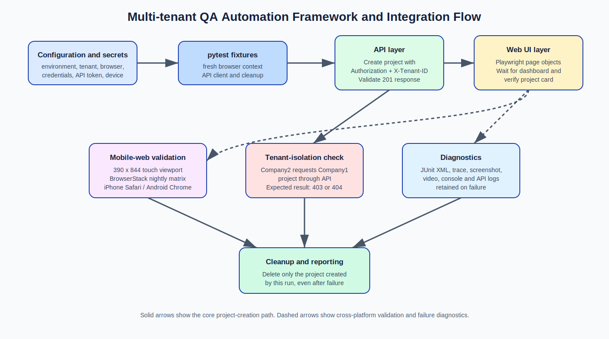

# Bynry QA Automation Engineering Intern — Case Study

This repository is Mahesh Shinde's submission for the Bynry QA Automation Engineering Intern case study. It demonstrates a scalable approach to testing a multi-tenant B2B SaaS platform across API, web UI, and responsive mobile-web layers.

## Submission contents

| Deliverable | Location |
| --- | --- |
| Test plan | [docs/test-plan.md](docs/test-plan.md) |
| Testing strategy and assumptions | [docs/testing-approach.md](docs/testing-approach.md) |
| Automated API tests | [tests/api](tests/api) |
| Automated UI tests | [tests/ui](tests/ui) |
| API-to-UI integration test | [tests/integration/test_project_creation_flow.py](tests/integration/test_project_creation_flow.py) |
| Example test data | [test_data/projects.json](test_data/projects.json) |
| Execution-report template | [docs/execution-report.md](docs/execution-report.md) |
| Framework and test-flow diagram | [docs/framework-and-test-flow.svg](docs/framework-and-test-flow.svg) |
| CI workflow | [.github/workflows/qa.yml](.github/workflows/qa.yml) |
| Submission document | [Mahesh_Shinde_Bynry_Case_Study_Submission.rtf](Mahesh_Shinde_Bynry_Case_Study_Submission.rtf) |

## Key coverage

- Login validation using stable accessible/test-ID locators and explicit business-state waits.
- API project creation, response validation, unique test data, and guaranteed cleanup.
- API-to-UI validation: a project created through the API appears in the correct tenant's UI.
- Tenant-isolation security check: a second tenant must receive `403` or `404` for the first tenant's project.
- Desktop and mobile-web viewport support through pytest command-line options.
- GitHub Actions smoke-test workflow with JUnit artifact retention.

## Project structure

```text
.
├── framework/       # Settings, reusable API client, and page objects
├── tests/           # API, UI, and integration coverage
├── test_data/       # Non-sensitive example test data
├── docs/            # Test plan, approach, and execution-report template
├── .github/         # GitHub Actions workflow
├── conftest.py      # pytest fixtures and browser/device options
└── requirements.txt
```

## Prerequisites

- Python 3.11 or newer
- Access to an approved QA or staging environment
- Dedicated Company1 and Company2 automation accounts
- API tokens with only the permissions needed to create and delete test projects

## Setup

```bash
python -m venv .venv
.venv\Scripts\activate          # Windows PowerShell
pip install -r requirements.txt
playwright install
```

## Framework and test-flow diagram



Copy `.env.example` to `.env` or set the same values in your shell/CI secret store. Never commit real credentials, API tokens, BrowserStack keys, or customer data.

## Run tests

```bash
# API checks
pytest -m api

# Browser UI checks in Chromium
pytest -m ui --browser chromium

# API-to-UI integration check in a mobile-web viewport
pytest -m integration --browser chromium --device mobile-web
```

Supported browser options are `chromium`, `firefox`, and `webkit`. Supported device options are `desktop` and `mobile-web`.

## CI and cross-platform strategy

Pull requests run API coverage and a fast Chromium smoke suite. A nightly pipeline should run the full regression suite across Chrome, Firefox, WebKit/Safari coverage, and a selected BrowserStack desktop/mobile-device matrix. This balances coverage, execution time, and BrowserStack cost.

For responsive mobile web, Playwright covers browser-device scenarios. A native Android/iOS application would use Appium with BrowserStack App Automate.

## Execution status

The tests are intentionally not reported as executed against Bynry systems: no approved environment, functional URLs, credentials, API tokens, or production selectors were provided with the assessment. The code is structured for execution once those approved values are supplied. See the clearly labeled [execution-report template](docs/execution-report.md).

## Security and data handling

The suite uses isolated browser contexts, unique project names per run, tenant-specific API headers, and cleanup in `finally` blocks. Test credentials and third-party keys belong in a secret manager or CI secrets—not in the repository.
